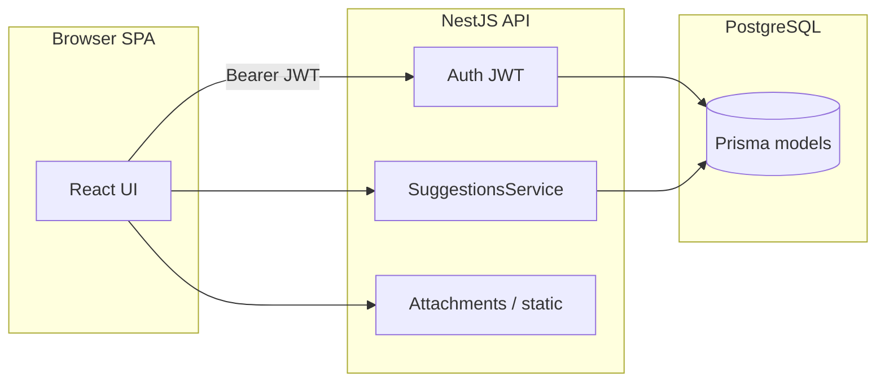

# Architecture

## Overview

The Kaizen platform is a **three-tier** setup:

1. **Browser (SPA)** — React application served by Vite in development and static assets in production.
2. **API (NestJS)** — REST JSON API, JWT authentication, role guards, validation, and file storage under a configurable upload root.
3. **Data (PostgreSQL)** — Accessed exclusively through **Prisma**; business rules for Kaizen workflow live mainly in `SuggestionsService`.

External integrations include **HRMS** (employee/unit/department master data and optional suggestion staging), **mobile idea** sync, and optional **Google GenAI** endpoints for suggestion analysis and evaluation scoring.

## Backend (NestJS)

Root module: `backend/src/app.module.ts`.

| Module | Responsibility |
|--------|----------------|
| `ConfigModule` | Loads `configuration` from environment |
| `ScheduleModule` | Cron-style scheduled tasks (HRMS / mobile sync as configured) |
| `PrismaModule` | Database client |
| `HealthModule` | Liveness-style endpoint |
| `AuthModule` | Login, JWT issue/verify, session refresh |
| `UsersModule` | Current user, directory lookups, admin role and scope management |
| `SuggestionsModule` | Kaizen CRUD, status transitions, BE report, PPTX export, HR reward photo |
| `WorkflowModule` | Placeholder controller; workflow logic is implemented inside suggestions |
| `AttachmentsModule` | Multipart uploads for idea and Kaizen template files |
| `HrmsSyncModule` | Admin-triggered HRMS sync |
| `HrmsMasterdataController` (`hrms`) | Authenticated read APIs for units/departments |
| `MobileIdeasSyncModule` | Admin-triggered import from mobile ideas store |
| `AiModule` | Authenticated AI helper endpoints |
| `ReportsModule` | BE-scoped analytics and export |

### HTTP stack details

- **CORS** enabled with `origin: true` (reflects request origin).
- **JSON body limit** raised to **50mb** for rendered-slide PPTX payloads.
- **Static files** — Upload root is exposed under **`/kaizen-files/`** with extra CORS handling for browser downloads.
- **Validation** — Global `ValidationPipe` with whitelist, forbid unknown properties, and implicit type conversion.

Configuration reference: `backend/src/config/configuration.ts` (`PORT`, `KAIZEN_UPLOAD_ROOT`, `NODE_ENV`).

## Frontend (React + Vite)

- Entry and routing of major views: `frontend/src/App.tsx`.
- **Session** — JWT and user profile persisted locally (`frontend/src/auth/session.ts`).
- **Role mapping** — Backend `RoleCode` values map to UI `Role` enum for menus and filtering (`App.tsx`).
- **Large feature surfaces** — `Dashboard.tsx`, `SuggestionForm.tsx`, `SuggestionDetailModal.tsx`, `Reports.tsx`, `UserManagement.tsx`, etc.

The UI calls the backend over HTTP (typical dev setup: Vite dev server proxying to Nest, or explicit API base URL depending on your deployment).

## Data flow (typical Kaizen)

## Security model (summary)

- **Authentication** — `POST /auth/login` returns a JWT; subsequent calls send `Authorization: Bearer <token>`.
- **Authorization** — Route handlers use `JwtAuthGuard` globally on protected controllers; admin-only routes add `TokenRolesGuard` with `@RequireTokenRoles(...)`.
- **Row-level / unit scoping** — Suggestion list and some transitions enforce unit and role rules in `SuggestionsService` (e.g. `assertUnitScopeAllowed`).

## Build artifacts

- Backend compiles to `backend/dist/` (Nest build).
- Frontend builds to `frontend/dist/` (Vite).

Do not treat `dist/` or local `uploads/` as source of truth for documentation; always prefer TypeScript sources and `schema.prisma`.
