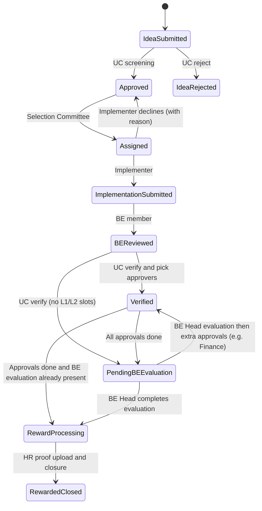

# Workflow

This document describes the **Kaizen (suggestion) lifecycle** as implemented in the backend (`SuggestionsService`, `suggestions.types.ts`) and exercised by the React app.

## Status model

Statuses are string values aligned with the `AppStatus` enum in `backend/src/modules/suggestions/suggestions.types.ts`:

| `AppStatus` constant | Stored / UI label |
|----------------------|-------------------|
| `IDEA_SUBMITTED` | Idea Submitted |
| `IDEA_REJECTED` | Idea Rejected |
| `APPROVED_FOR_ASSIGNMENT` | Approved |
| `ASSIGNED_FOR_IMPLEMENTATION` | Assigned |
| `IMPLEMENTATION_DONE` | Implementation Submitted |
| `BE_REVIEW_DONE` | BE Reviewed |
| `VERIFIED_PENDING_APPROVAL` | Verified |
| `BE_EVALUATION_PENDING` | Pending BE Evaluation |
| `REWARD_PENDING` | Reward Processing |
| `REWARDED` | Rewarded & Closed |

`current_stage_role` on each suggestion row is a denormalized hint for **who owns the next action** (derived in `deriveCurrentStageRole`).

## Happy-path pipeline (conceptual)

Send-back and rework paths exist (see transitions below).

## Roles (`AppRole`)

Display strings used in API DTOs and persisted alongside workflow events:

- Employee-facing and operational roles: **Unit Coordinator**, **Selection Committee**, **Implementer**, **Business Excellence Member**, **Business Excellence Head**, functional heads (**Head - Quality / Finance / HR / Operations / Nursing**), **Admin**.

JWT `RoleCode` values (database) are mapped to these `AppRole` strings for authorization checks (`auth-role-mapping.ts`).

## Allowed status transitions (backend guard)

Authoritative matrix: `SuggestionsService.assertTransitionAllowed` in `backend/src/modules/suggestions/suggestions.service.ts`.

The following **from → to** transitions are registered there (subject to additional business rules in `updateStatus`):

| From | To | Typical actors (AppRole) |
|------|-----|---------------------------|
| Idea Submitted | Approved | Unit Coordinator, Admin |
| Idea Submitted | Idea Rejected | Unit Coordinator, Admin |
| Implementation Submitted | Assigned | Business Excellence Member, Admin (BE send-back) |
| BE Reviewed | Implementation Submitted | Unit Coordinator, Implementer, Admin (rework / UC send-back) |
| Approved | Assigned | Selection Committee, Admin |
| Assigned | Approved | Implementer (assigned only), Admin — requires `assignmentDenialNotes`; clears assignee fields |
| Assigned | Implementation Submitted | Implementer, Business Excellence Member, Admin |
| Implementation Submitted | BE Reviewed | Business Excellence Member, Admin |
| BE Reviewed | Verified | Unit Coordinator, Admin |
| BE Reviewed | Pending BE Evaluation | Unit Coordinator, Admin |
| Verified | Pending BE Evaluation | Unit Coordinator, Admin, functional heads |
| Verified | Reward Processing | Unit Coordinator, Admin, functional heads |
| Verified | BE Reviewed | Functional heads, Admin (send-back with remarks) |
| Pending BE Evaluation | Verified | Business Excellence Head, Admin |
| Pending BE Evaluation | Reward Processing | Business Excellence Head, Admin |
| Reward Processing | Rewarded & Closed | Head - HR, Unit Coordinator, Admin |

**Same-status updates** — Many PATCH calls keep `status` unchanged while updating implementation progress, partial approvals, or department slot sign-offs; `assertTransitionAllowed` returns early when `current === next`.

## Approval phases (L1 / L2)

When a Unit Coordinator moves a suggestion from **BE Reviewed** toward approvals:

- **Level 1 (`L1`)** — Named **department** approvers (`departmentApprovals` JSON). Each slot records `approvedAt` when signed.
- **Level 2 (`L2`)** — Functional heads listed in `requiredApprovals` with boolean map `approvals`.

Rules enforced in `updateStatus` include:

- Functional head approvals cannot be written until **L1 is complete** when `approvalPhase` is `L1`.
- When L1 completes and there are **no** L2 slots, the workflow can auto-advance to **Pending BE Evaluation** on a same-status update pattern handled in service logic.

## Notable business rules

- **UC screening** — When approving or rejecting at **Idea Submitted**, Unit Coordinator must supply **theme** (heading) and **clinical/supportive category**; rejection requires **screening remarks**.
- **Finance threshold** — If reward evaluation voucher value is **greater than 2000**, **Head - Finance** is injected into `requiredApprovals` when entering **Verified** (if not already present).
- **Reward processing** — Moving **Verified → Reward Processing** requires completed approvals **and** a positive voucher value in `rewardEvaluation`.
- **Final closure** — **Reward Processing → Rewarded** requires an uploaded **HR reward validation** image (`hr_reward_validation_image_path`).
- **Implemented Kaizen record** — On first transition to **Rewarded**, an `implemented_kaizen` row is upserted with a generated `implemented_code` and snapshot.

## Workflow history

Each transition appends an object to `workflow_thread` JSON: `{ id, actor, role, text, date }` (`WorkflowEvent` type).

## Sync workflows (parallel to Kaizen)

- **HRMS sync** — Admin triggers `POST /hrms-sync/run-now` to refresh staging / mirror tables (see `HrmsSyncService`).
- **Mobile ideas sync** — Admin triggers `POST /mobile-ideas-sync/run-now` to import mobile-side suggestions.

These feeds can create or update suggestions with `source = MOBILE` depending on sync implementation.
